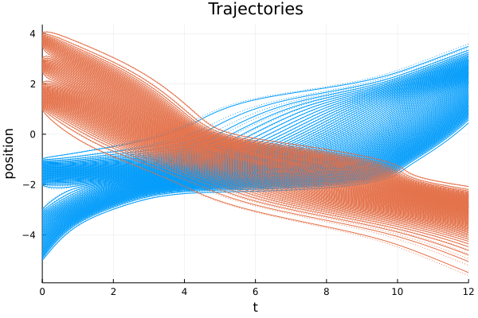

# ConservationLawsParticles.jl

<!--  -->
<!--


 -->
[](https://FedericoStra.github.io/ConservationLawsParticles.jl/stable)
[](https://FedericoStra.github.io/ConservationLawsParticles.jl/dev)
[](https://github.com/FedericoStra/ConservationLawsParticles.jl/actions)
[](https://github.com/invenia/BlueStyle)
[](https://github.com/SciML/ColPrac)

Particle methods for 1D conservation laws.

This package implements the deterministic particle schemes described in the article

> **E. Radici, F. Stra**:
> *Entropy solutions of mildly singular non-local scalar conservation laws with congestion via deterministic particle method*.
> SIAM Journal on Mathematical Analysis 55.3 (2023), pp. 2001-2041.
> DOI: [https://doi.org/10.1137/21M1462994](https://doi.org/10.1137/21M1462994).
> arXiv: [https://arxiv.org/abs/2107.10760](https://arxiv.org/abs/2107.10760).

You can cite the article as

```bibtex
@article{Radici-Stra-2023,
 author = {Radici, Emanuela and Stra, Federico},
 title = {Entropy solutions of mildly singular nonlocal scalar conservation
          laws with congestion via deterministic particle methods},
 journal = {SIAM Journal on Mathematical Analysis},
 volume = {55},
 number = {3},
 pages = {2001-2041},
 year = {2023},
 issn = {0036-1410, 1095-7154},
 doi = {10.1137/21M1462994},
 url = {https://epubs.siam.org/doi/10.1137/21M1462994},
 eprint = {2107.10760},
 eprinttype = {arxiv},
 eprintclass = {math.AP},
 keywords = {entropy solutions, nonlinear mobility, nonlocal interaction,
             deterministic particle method, Lagrangian discretization,
             numerical scheme},
 addendum = {MSC: 35L65, 65M12, 65M75},
}
```

The convergence rate of the scheme is studied (among other results) in the follow-up article

```bibtex
@article{Marconi-Radici-Stra-2024,
 author = {Marconi, Elio and Radici, Emanuela and Stra, Federico},
 title = {Stability of quasi-entropy solutions of non-local scalar
          conservation laws},
 journal = {Calculus of Variations and Partial Differential Equations},
 volume = {64},
 number = {3},
 pages = {},
 year = {2024},
 date = {2024-11-16},
 issn = {1432-0835},
 doi = {10.1007/s00526-024-02848-9},
 url = {https://link.springer.com/article/10.1007/s00526-024-02848-9},
 eprint = {2211.02450},
 eprinttype = {arxiv},
 eprintclass = {math.AP},
 keywords = {entropy solutions, conservation laws},
 addendum = {MSC: 35L65, 65M12},
}
```

Please refer to the [documentation](https://federicostra.github.io/ConservationLawsParticles.jl)
for additional ways to cite this work.

## Example

Particles trajectories and time evolution of the densities of two interacting species.



See the "Examples" section in the
[stable](https://federicostra.github.io/ConservationLawsParticles.jl/stable/examples/)
or [dev](https://federicostra.github.io/ConservationLawsParticles.jl/dev/examples/)
documentation for more.
