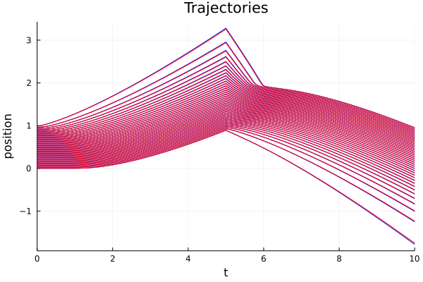
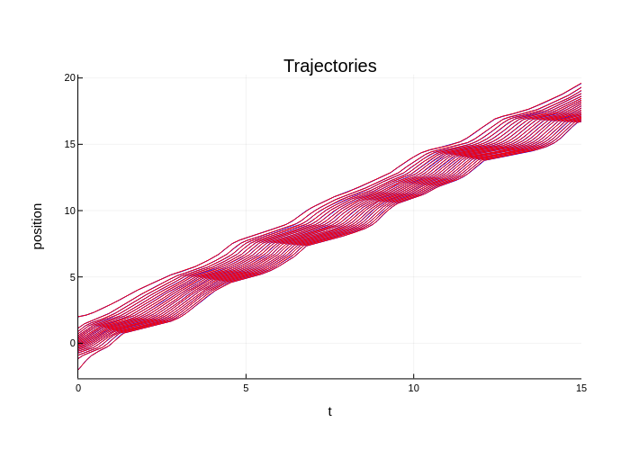
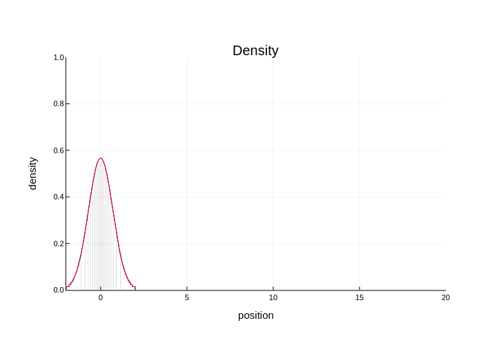

# Examples

## Jupyter Notebook examples

- [fancy example](Fancy.html) with time-dependend velocity field and interaction,
- [simple traffic model](Traffic.html),
- [complex traffic model](Traffic_time-dependent.html) with time-dependent external velocity.

## Simple example

```julia
using ConservationLawsParticles
using RecursiveArrayTools, DifferentialEquations, Plots

# model
V(t, x) = t < 5 ? one(x) : -one(x)
Wprime(t, x) = sign(x) / (abs(x) + 1)
W(t, x) = log(abs(x) + 1)
mob(ρ) = max(1 - ρ, 0)
smodel = SampledModel((V,), ((Wprime,),), (mob,))
imodel = IntegratedModel((V,), ((W,),), (mob,))

# initial condition
x0 = ArrayPartition(vcat(range(0, 1, length=80)))

# time span
tspan = (0., 10.)

# ODE system for the particles
sprob = ODEProblem(velocities!, x0, tspan, smodel)
iprob = ODEProblem(velocities!, x0, tspan, imodel)

abstol = reltol = 1e-7;
@time ssol = solve(sprob, BS5(); abstol=abstol, reltol=reltol);
@time isol = solve(iprob, BS5(); abstol=abstol, reltol=reltol);

# plot the particle trajectories
plot(title="Trajectories", xlabel="time", ylabel="position", legend=false)
plot!(ssol, vars=1:2:80; color=:blue)
plot!(isol, vars=1:2:80; color=:red)
savefig("simple.png")
```



```julia
# plot an animation of the density
anim = @animate for t in range(tspan...; step=1/48)
    p = plot(title="Density", xlabel="position", ylabel="density",
        legend=false, xlims=(-2,4), ylims=(0,1))
    plot_density!(p, ssol(t); color=:blue)
    plot_density!(p, isol(t); color=:red)
    p
end
gif(anim, "simple.gif")
```


## Traffic example

```julia
using ConservationLawsParticles
using RecursiveArrayTools, DifferentialEquations, Plots

# model
V(t, x) = 3 + (1+sin(3t)) * cos(4x)
# Wprime(t, x) = x - 2sign(x) / (abs(x) + 1)^2
Wprime(t, x) = 2 * sign(x) / (abs(x) + 1)
mob(ρ) = max(1 - ρ, 0)
model = SampledModel((V,), ((Wprime,),), (mob,))

# initial condition
x0 = ArrayPartition(gaussian_particles(2, 801))

# time span
tspan = (0., 5.)

# ODE system for the particles
prob = ODEProblem(velocities!, x0, tspan, model)

sol = solve(prob, BS5(); reltol=1e-8, abstol=1e-8)

# plot the particle trajectories
plot(sol, vars=1:40:801; legend=false, color=:blue,
    title="Trajectories", xlabel="time", ylabel="position")
savefig("traffic.png")
```


```julia
# plot an animation of the density
anim = @animate for t in range(tspan...; step=1/48)
    plot_density(sol(t); color=:blue, legend=false, xlims=(-2,12), ylims=(0,1),
        title="Density", xlabel="position", ylabel="density")
end
gif(anim, "traffic.gif")
```


## Traffic example

```julia
using ConservationLawsParticles
using RecursiveArrayTools, DifferentialEquations, Plots

# model
V(t, x) = 2 + 0.5sin(2x) + 0.3sin(2sqrt(2)*x) + 0.2cos(2sqrt(7)*x)
W(t, x) = x^2/2 - abs(x)
W′(t, x) = x - sign(x)
# W(t, x) = (a=abs(x); a*log(a+1/4))
# W′(t, x) = (a=abs(x); sign(x) * (log(a+1/4) + a/(a+1/4)))
mob(ρ) = max((ρ-1)^2 * (2ρ+1), 0)
smodel = SampledModel((V,), ((W′,),), (mob,))
imodel = IntegratedModel((V,), ((W,),), (mob,))

# initial condition
x0 = ArrayPartition(gaussian_particles(2, 401))

# time span
tspan = (0., 15.)

# ODE system for the particles
sprob = ODEProblem(velocities_gen!, x0, tspan, smodel)
iprob = ODEProblem(velocities_gen!, x0, tspan, imodel)

abstol = reltol = 2e-8

@time ssol = solve(sprob, BS5(); abstol=abstol, reltol=reltol);
@time isol = solve(iprob, BS5(); abstol=abstol, reltol=reltol);

# plot the particle trajectories
plot(legend=false, title="Trajectories", xlabel="time", ylabel="position")
plot!(ssol, vars=1:20:401; color=:blue)
plot!(isol, vars=1:20:401; color=:red)
savefig("advanced-traffic.png")
```



```julia
# plot an animation of the density
anim = @animate for t in range(tspan...; step=1/24)
    p = plot(legend=false, xlims=(-2,20), ylims=(0,1),
        title="Density", xlabel="position", ylabel="density")
    x = ssol(t).x[1]
    min_dens = minimum(pwc_densities(x)[1][1,:,:], dims=1)[:];
    plot!(p, repeat(x, inner=(1,2))[1:20:401,:]',
        hcat(zero(min_dens), min_dens)[1:20:401,:]',
        color=:gray, opacity=.25)
    plot_density!(p, ssol(t); color=:blue)
    plot_density!(p, isol(t); color=:red)
end
gif(anim, "advanced-traffic.gif")
```



## Two species example

```julia
using ConservationLawsParticles
using RecursiveArrayTools, DifferentialEquations, Plots

# external velocities
Vr(t, x) = 2.
Vl(t, x) = -2.
# interactions
W_attr(t, r) = 5 * log(abs(r) + 1)
W_rep(t, r) = -2 * log(abs(r) + 1)
W(t, r) = 2 * (exp(abs(r)/4) + exp(-2abs(r)))
# mobilities
mobρ(ρ, σ) = max(2 - ρ - 0.5σ, 0)
mobσ(ρ, σ) = max(2 - σ - 0.5ρ, 0)

imodel = IntegratedModel(
    (Vr, Vl),
    ((W, W_rep),
     (W_rep, W)),
    (mobρ, mobσ))

n = 20
x0 = ArrayPartition(
    vcat(range(-2., -1.5, length=n), range(-1., -.5, length=n)),
    vcat(range(.5, 1.5, length=2n)))

tspan = (0., 1.2)

prob = ODEProblem(velocities!, x0, tspan, imodel)

sol = solve(prob, BS5(), reltol=1e-6, abstol=1e-6)

plot(legend=false)
plot!(sol, vars=1:2n, color=:blue)
plot!(sol, vars=2n+1:4n, color=:red)
plot!(title="2-species integrated scheme", xlabel="time", ylabel="position")

savefig("two-species.png")
```


```julia
n = 60
x0 = ArrayPartition(
    vcat(range(-2., -1.5, length=n), range(-1., -.5, length=n)),
    vcat(range(.5, 1.5, length=2n)))

prob = ODEProblem(velocities!, x0, tspan, imodel)

sol = solve(prob, BS5(), reltol=1e-7, abstol=1e-7)

anim = @animate for t in tspan[1]:1/48:tspan[2]
    p = plot(title="2-species integrated scheme", xlabel="position", ylabel="density",
        legend=false, xlims=(-4,4), ylims=(0,1))
    plot_density!(p, sol(t).x[1], color=:blue)
    plot_density!(p, sol(t).x[2], color=:red)
end

gif(anim, "two-species.gif")
```


